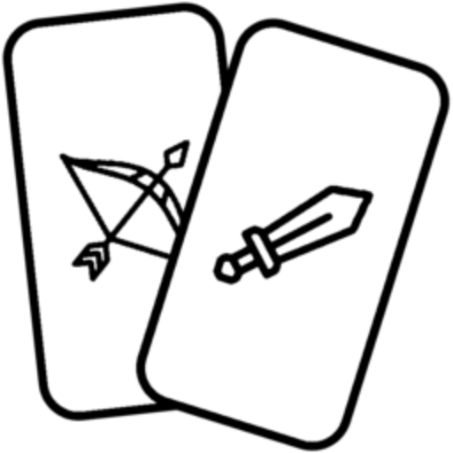

# Gwent Board

Welcome to GwentBoard! This is a tool designed to help players keep track of the score while playing the card game Gwent. It is available on both Google Play and the Apple Store.

<table>
    <tr>
        <td></td>
        <td>
            Love playing classical Gwent but find it hard to keep track of the score? This is the app for you!
            <table>
                <tr>
                    <td></td>
                    <td></td>
                </tr>
            </table>
        </td>
    </tr>
</table>

## Screenshots

## Release Notes
